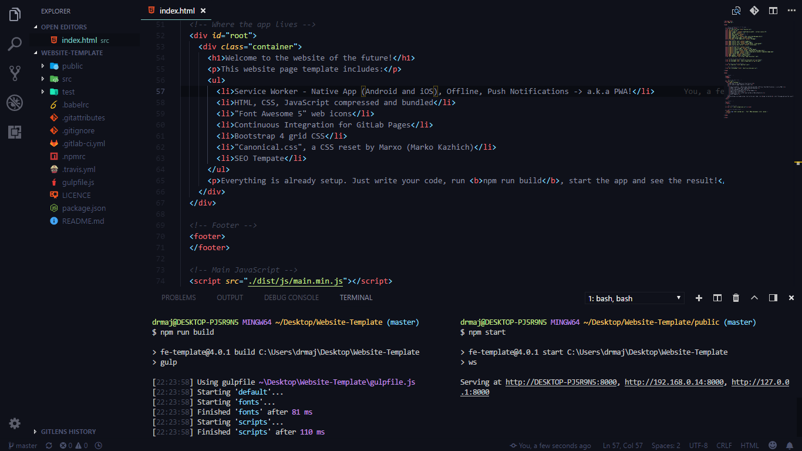

[](https://www.browserstack.com/automate/public-build/vladimir774:9sP4x15bNG6zVTHS8Hox)
[](https://greenkeeper.io/) 
[](https://travis-ci.org/VladimirDev93/Website-Template)
[](https://david-dm.org/VladimirDev93/Website-Template?type=dev)

# Welcome to the website of the future!
This website page template includes:
- Service Worker - Native App (Android and iOS), Offline, Push Notifications => a.k.a PWA!
- HTML, CSS, JavaScript compressed and bundled
- Browserify, use npm packages!
- "Font Awesome 5" web icons
- Continuous Integration for GitLab Pages
- Bootstrap 4 grid CSS
- "Canonical.css", a CSS reset by [Marxo](https://twitter.com/marxo) (Marko Kazhich)
- AVA Tests
- NYC Code Coverage
- WebdriverIO
- Sitemap.xml Generator
- SEO Template

Everything is already setup. Just write your code, run **npm run build**, start the app and see the result!

# Installation (WIP)

**Not yet implemented!**

```bash
npm i -g fe-template
```

# Usage

```bash
fe-template my-website
```

# Manual installation and usage

1. Clone the repo.
```bash
git clone https://github.com/VladimirDev93/website-template.git
```

2. Open the terminal in ``website-template`` directory, and enter the following command first.
```bash
npm i 
```

3. Run the following command in your terminal, in order to configure ESLint file.
```bash
npm run eslint
```

4. Navigate to `src` folder and edit your files from there. Build the application first in order to see the result.
```bash
npm run build
```

5. Navigate to the `public` folder and run this command to see the results.
```bash
npm start
```

# Example

This is an example on how you can use the popular Visual Studio Code editor to develop your website.
On the left terminal you can run the `npm run build` command every time you make changes, and on the right terminal
you can watch if the error occurs with your local development server.



# Licence

MIT License

Copyright (c) 2018 Vladimir Jovanović

Permission is hereby granted, free of charge, to any person obtaining a copy of this software and associated documentation files (the "Software"), to deal in the Software without restriction, including without limitation the rights to use, copy, modify, merge, publish, distribute, sublicense, and/or sell copies of the Software, and to permit persons to whom the Software is furnished to do so, subject to the following conditions:

The above copyright notice and this permission notice shall be included in all copies or substantial portions of the Software.

THE SOFTWARE IS PROVIDED "AS IS", WITHOUT WARRANTY OF ANY KIND, EXPRESS OR IMPLIED, INCLUDING BUT NOT LIMITED TO THE WARRANTIES OF MERCHANTABILITY, FITNESS FOR A PARTICULAR PURPOSE AND NONINFRINGEMENT. IN NO EVENT SHALL THE AUTHORS OR COPYRIGHT HOLDERS BE LIABLE FOR ANY CLAIM, DAMAGES OR OTHER LIABILITY, WHETHER IN AN ACTION OF CONTRACT, TORT OR OTHERWISE, ARISING FROM, OUT OF OR IN CONNECTION WITH THE SOFTWARE OR THE USE OR OTHER DEALINGS IN THE SOFTWARE.


[](https://app.fossa.io/projects/git%2Bgithub.com%2FVladimirDev93%2FWebsite-Template?ref=badge_large)
